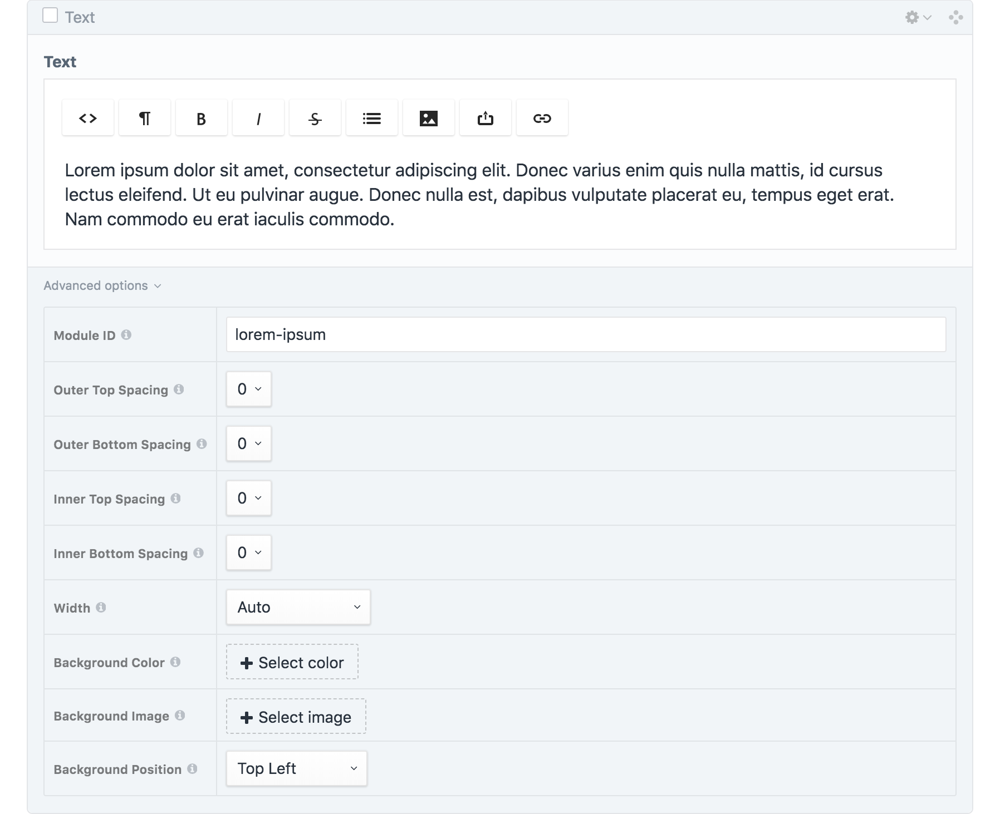

# Module System

TODO: Intro paragraph

## Dependencies

* **[Craft 3](https://github.com/craftcms/cms)** - Content management system that provides the Matrix field type – the base for modular content creation.
* **[Blockonomicon](https://github.com/charliedevelopment/craft3-blockonomicon/)** - Craft 3 plugin that can bundle a module as a self-contained package of HTML, CSS, JS, and JSON.
* **[Super Table](https://github.com/verbb/super-table)** - Craft 3 plugin that adds a new field type for organizing multiple fields into one.
* **[Encapsulator](https://github.com/charliedevelopment/encapsulator)** - Yii module for Craft 3 that encapsulates select matrix block fields into a disclosure element.

## Constituents

* **Module Config** - Super Table field that gets copied to each module to provide the configuration options.
* **Module HTML** - HTML file that provides the infrastructure that wraps the content of each module.
* **Module CSS** - CSS file that styles the Module HTML.
* **Module JS** - JS file that adds a front-end administrative interface to each module.

## Overview

In the **Craft** back-end, a matrix field called **Modules** contains every **module** as a block. With **Blockonomicon**, it is easy to add and remove modules. Since each module is stored as a bundle, a module can be exported from one site and imported into another. The module's field configuration and source code will remain intact.

Often times, new modules need to be created. This is also easy with Blockonomicon. Once you create the module's fields and export for the first time, the bundle is automatically created with boilerplate code to accelerate development and ensure consistency.

Now, each module block within the Modules field contains its own subfields. For example, a "Text" module would simply have a rich text editor (_Fig. 1_). In addition, each module also gets its own copy of the **Module Config**, which is the **Super Table** field that has options such as "Width" and "Background Color".

In an elaborate module, the interface can become quite complex – considering that the Module Config alone has about 10 subfields. **Encapsulator** improves the module interface by relegating the Module Config field to a disclosure at the bottom of the block (_Fig. 2_). The disclosure gets the label "Advanced options" and is collapsed by default. This keeps the options accessible to those who need them, while streamlining the interface and safegaurding against unnecessary tampering.

_Fig 1: A text module._

_Fig 2: A text module with the "Advanced options" panel expanded._

## Module Config Options

Every module comes with configuration options that dictate the style of the infrastructure that wraps its content. The purpose of this model is to shift as much responsibility as possible from the module to the module framework. A module should not be concerned with setting its own width, spacing, or background. These are matters that pertain to all modules, therefore they should be dealt with at a higher level. In this system, modules are focused entirely on their own content, indifferent about where or how they are displayed.

These fields have the same values from module to module, but each module can have its own defaults. For example, it is likely that a banner module will always be set to full-width, so new banner modules should should be full-width by default. If each module has sensible default values in place, content editors will not have to modify configuration fields often.

### Module ID

> Unique identifier for linking purposes, written lowercase with hyphens.

This is a text field for specifying the ID of the module, which is necessary in order to link to it directly.

### Spacing

> Amount of additional top/bottom space outside/inside the module.

This is a set of four dropdowns for selecting the spacing values.

TODO: Spacing diagram

| Option | Height (rem) | Height (px) |
|:--- |:--- |:--- |
| `0` | 0rem | 0px |
| `1` | 0.75rem | 12px |
| `2` | 1.5rem | 24px |
| `3` | 3rem | 48px |
| `4` | 4.5rem| 72px |
| `5` | 6rem | 96px |
| `6` | 7.5rem | 120px |
| `7` | 9rem | 144px |
| `8` | 10.5rem | 168px |

### Width

> Size of the module relative to the site container.

This is a dropdown field for selecting a width setting.

TODO: Width diagram

| Option | Content Width |
|:--- |:--- |
| `Auto` | Same as site container |
| `Auto Extended` | Same as site container with full-width background |
| `Slim` | Narrower than site container |
| `Slim Extended` | Narrower than site container with full-width background |
| `Wide` | Wider than site container |
| `Wide Extended` | Wider than site container with full-width background |
| `Full` | Full-width |

### Background Color

> Color to display underneath the module's content.

This is a category field that pulls from a category group called "Background Colors". The benefit of using a category field is that colors can be added and removed at any time, and every module will automatically have the latest set of options.

### Background Image

> Image to display underneath the module's content.

This is an asset field that allows the selection or upload of any image file.

### Background Position

> Alignment of the module's background image (if present).

This is a dropdown field for specifying how the background image should be cropped.

| Option | CSS value |
|:--- |:--- |
| `Top Left` | top left |
| `Top Center` | top center |
| `Top Right` | top right |
| `Center Left` | center left |
| `Center Center` | center center |
| `Center Right` | center right |
| `Bottom Left` | bottom left |
| `Bottom Center` | bottom center |
| `Bottom Right` | bottom right |
